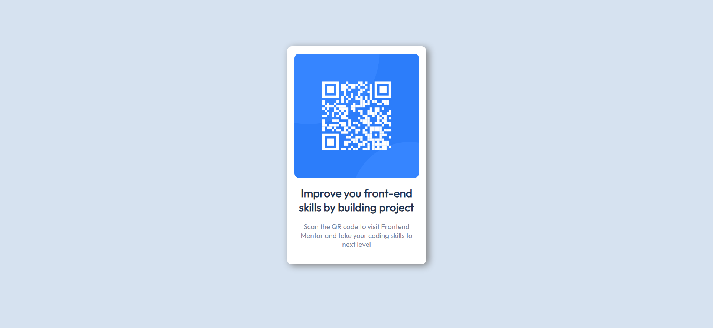

This is a solution to the [QR code component challenge on Frontend Mentor](https://www.frontendmentor.io/challenges/qr-code-component-iux_sIO_H). Frontend Mentor challenges help you improve your coding skills by building realistic projects.

### Links

- Solution URL: https://github.com/Slavi123456/FrontendMentor
- Open the mainPage.html

## My process
   I rewrite my code like three times or more so ...
### Built with

- HTML5
- CSS
- Flexbox

### Continued development

I would like to grasp the basics of web development with Html, CSS and JavaScript. If anyone is willing and have good resources to send i would apreciate them a lot. 
### Useful resources

- Mostly youtube vidios like this https://www.youtube.com/watch?v=qTEDcXJ-dzw for every little need in my project. 

